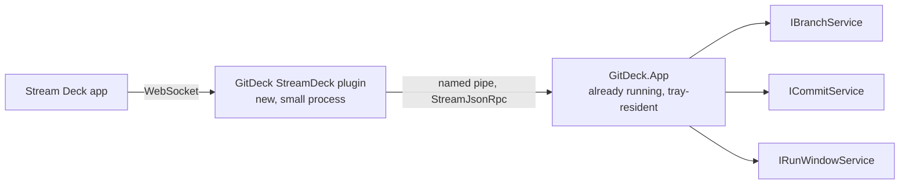
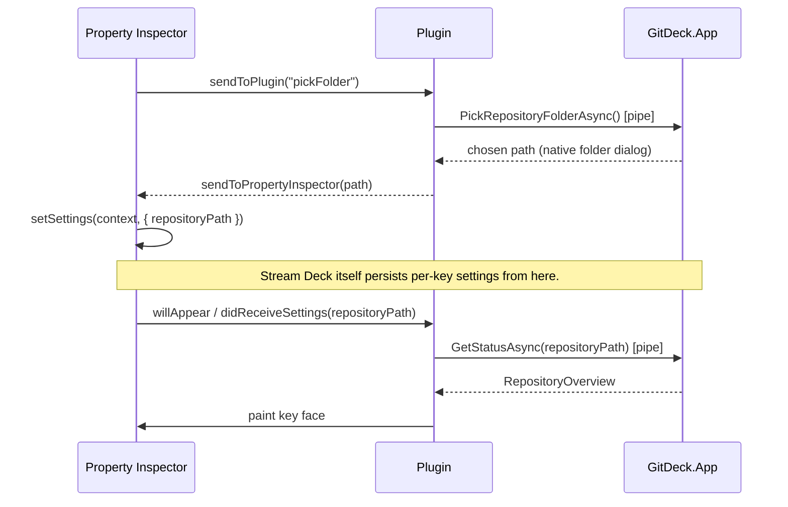

# Stream Deck plugin — design notes

Status: proposal, not started. Captures the design discussion from 2026-08-04 so it doesn't
live only in chat history.

## Goal

Let a user assign a Stream Deck key to a specific git repository and, from that key: see its
status at a glance (branch, ahead/behind) and trigger fetch/pull/branch-switch/commit without
touching the keyboard-driven palette — while still handing off to the palette for anything that
actually needs typing.

## Why this is a smaller lift than it looks

Three things already in the codebase point at this exact design:

- **`GitDeck.Ipc` already references StreamJsonRpc.** It's currently an empty `Class1.cs`, but
  the transport choice was made before this doc existed. This is the first real thing to put in
  it.
- **`GitDeck.App` is already tray-resident**, not a window that opens and closes. `App.axaml.cs`
  sets `ShutdownMode.OnExplicitShutdown` and hides windows on close instead of destroying them —
  it only exits via the tray menu. That's exactly the kind of always-on background process a
  Stream Deck plugin needs to talk to.
- **`IBranchService` already takes `repositoryPath` as a parameter on every call**, not an
  implicit "the configured repo." Only the ViewModels (`RunViewModel`, `BranchPaletteViewModel`)
  currently hard-code `settingsService.Settings.RepositoryPath` as *the* repo. The git layer
  itself has no idea there's only supposed to be one.

## Topology: two processes, not one



Don't merge the plugin into GitDeck.App. Stream Deck starts and stops its plugin process on its
own schedule (profile switches, plugin restarts, updates). If that process *were* GitDeck.App,
the user's global hotkeys and any open palette would die every time Stream Deck recycled the
plugin. Two processes that rendezvous over a named pipe keeps GitDeck.App's tray lifecycle
exactly as it is today; the Stream Deck integration becomes purely additive, and if GitDeck.App
isn't running the key just shows "disconnected" instead of anything breaking.

This is also why StreamJsonRpc over IPC beats the plugin linking `GitDeck.Git.dll` directly and
making its own libgit2/git.exe calls: one process should own git state, the settings file, and
"is an operation already in flight" — which is exactly what GitDeck.App's existing services
already do carefully (preflight checks, cancellation, `GIT_TERMINAL_PROMPT=0`, ff-only pulls).
Reuse that over one IPC hop rather than forking a second copy of it.

## The IPC contract (`GitDeck.Ipc`)

No parallel DTO layer — `RepositoryOverview`, `FetchResult`, `PullResult`, etc. are already plain
records and JSON-serializable as-is. StreamJsonRpc can expose an object's methods directly
(`JsonRpc.Rpc(stream, target: someService)`), but wrap a small facade rather than exposing
`IBranchService` raw: two of the calls a key needs aren't git operations at all, they're "focus
the app's UI."

```csharp
public interface IGitDeckIpc
{
    Task<RepositoryOverview> GetStatusAsync(string repositoryPath, CancellationToken ct);
    Task<FetchResult> FetchAsync(string repositoryPath, CancellationToken ct);
    Task<PullResult> PullAsync(string repositoryPath, CancellationToken ct);

    // UI hand-off, not a git operation — see "app-side change" below.
    Task OpenBranchesAsync(string repositoryPath, CancellationToken ct);
    Task OpenCommitAsync(string repositoryPath, CancellationToken ct);

    // Backs the Property Inspector's repo picker.
    Task<string?> PickRepositoryFolderAsync(CancellationToken ct);
    Task<IReadOnlyList<string>> GetRecentRepositoriesAsync(CancellationToken ct);
}
```

Server side: GitDeck.App hosts a `NamedPipeServerStream` accept-loop as a background service
registered in the same DI container `Program.cs` already builds. `IGitDeckIpc`'s implementation
just composes the existing singletons (`IBranchService`, `IRunWindowService`,
`IFilePickerService`) — no duplicated logic anywhere.

## The one real app-side change: a repo override

Today, `IRunWindowService.Toggle(RunMode)` and `RunViewModel.OpenAsync` always read
`_settingsService.Settings.RepositoryPath` — there is exactly one "current repo" for the whole
app. A Stream Deck key needs to open the Branches/Commit palette *for its own configured repo*,
which might not be the one open at the desk right now. Small, identifiable change:

```csharp
Task Toggle(RunMode mode, string? repositoryPathOverride = null);
```

threaded through to `RunViewModel.OpenAsync`, falling back to `Settings.RepositoryPath` when
null — the hotkey path behaves identically to today, and the IPC path can target any repo. This
is the only place the Stream Deck feature pushes on the app's architecture; everything else is
additive.

Worth stating as a principle, not just an implementation detail: **the key triggers and glances,
the palette still does anything needing a keyboard.** There is no sane way to type a commit
message or a new branch name on a keypad with no display beyond icon and title. "Quick Commit" on
a key opens the Commit palette (pre-scoped to that repo) rather than trying to commit blind — it
hands off to the existing UI instead of reinventing it.

## Per-key repo selection

Mostly Stream Deck doing what it already does — per-key settings via `setSettings` /
`didReceiveSettings`, scoped by `context`. One thing GitDeck itself needs to grow: `AppSettings`
currently has a single `RepositoryPath` string, nothing tracks "repos used before." Add a small
MRU (`RecentRepositoryPaths`, capped ~10), appended to on any successful path resolution.



The "Browse…" folder dialog reuses the same native picker `IFilePickerService` already uses in
Settings — no new picker UI to build.

## Key face, mapped onto existing data

The key's title/badge is just `RepositoryOverview` rendered small — branch name as title, badge
colour from `HasUpstream` / `BehindBy` / `AheadBy` / `LoadError`, the same fields the palette
footer already renders (see [fetch & pull](../GitDeck.Git/Repositories/BranchInfo.cs) work).
Refresh on a timer (minutes, not constant polling — same "quiet background fetch" philosophy as
the palette), plus immediately on `willAppear` and right after a Pull completes.

| State | Face |
|---|---|
| Up to date | Branch name, neutral/green badge |
| Behind upstream | Branch name, blue badge with count (pullable) |
| No upstream configured | Branch name, grey badge, no count |
| Repo not found / load error | Warning badge, error as tooltip |
| GitDeck.App not reachable | Distinct "disconnected" face, auto-retry connect |

## Actions to ship

A small family, not one mega-action — each with the same repo-picker Property Inspector:

- **Repo Status** — press pulls if behind, else opens Branches scoped to that repo; face shows
  live ahead/behind.
- **Fetch** — silent refresh only, for anyone who wants fetch decoupled from pull.
- **Quick Commit** — opens the Commit palette scoped to that repo (reuses existing AI commit
  message generation).

## Plugin implementation language — resolved: Elgato's internal Node/TypeScript SDK

`GitDeck.Ipc` is StreamJsonRpc, which is .NET-only, so this doc originally defaulted to a small
.NET console app hand-rolling the Stream Deck WebSocket protocol, to avoid a two-language split —
while flagging that this should defer to whatever internal Stream Deck plugin conventions/
templates exist at Elgato. Decision: use Elgato's internal Node/TypeScript SDK. That means the
plugin process is Node, not .NET, and has to reach `GitDeck.App`'s named pipe without a shared
StreamJsonRpc client.

A throwaway interop spike (a .NET console app serving `IGitDeckIpc` over a test named pipe, called
by a Node script using nothing but the built-in `net` module) confirmed this is entirely workable
and pinned down the exact wire contract a Node client has to match:

- **Framing**: `HeaderDelimitedMessageHandler` sends `Content-Length: <n>\r\n\r\n<json>` — the same
  framing the Language Server Protocol uses. The `vscode-jsonrpc` npm package implements this
  exact framing, so a real plugin likely wants that instead of hand-rolling it as the spike did.
- **Casing**: `SystemTextJsonFormatter` serializes properties in **PascalCase**, matching the C#
  names exactly (confirmed: a `GetStatusAsync` response came back as `{"IsRepository":true,
  "WorkingDirectory":"...", "HasUpstream":true, "AheadBy":1, "BehindBy":3, ...}` — not camelCase).
  The Node client's types must read `overview.IsRepository`, not `overview.isRepository`.
- **Method names**: called literally as the C# interface member name, `Async` suffix included
  (`"method":"GetStatusAsync"`) — StreamJsonRpc does not strip it by convention.
- **Parameters**: positional array params work (`"params":["C:\\repos\\demo"]`) and bind correctly
  against `GetStatusAsync(string repositoryPath, CancellationToken ct = default)`, with the
  trailing `CancellationToken` simply omitted from the array rather than needing a placeholder.

See the implementation plan below for where `GitDeck.Ipc`, `GitDeckIpc`, and `GitDeckIpcServer`
already live — Phase 1 is implemented and tested; the Node-side client is Phase 3.

## Implementation plan

Rough phases; each is independently shippable/testable before moving to the next.

### Phase 1 — IPC plumbing, no Stream Deck yet
- [ ] Define `IGitDeckIpc` and its pipe-name constant in `GitDeck.Ipc`.
- [ ] Implement the server side in `GitDeck.App` (`NamedPipeServerStream` accept-loop as a
      hosted singleton, wired into `Program.cs`'s existing `ServiceCollection`).
- [ ] Implement `IGitDeckIpc` by composing `IBranchService` + `IRunWindowService` +
      `IFilePickerService`.
- [ ] Write a throwaway console client (or a test) that connects and calls `GetStatusAsync`
      against a real repo, to prove the pipe round-trips before any plugin code exists.

### Phase 2 — app-side repo override
- [ ] Add `repositoryPathOverride` to `IRunWindowService.Toggle` / `RunWindowService` /
      `RunViewModel.OpenAsync`, falling back to `Settings.RepositoryPath` when null.
- [ ] Add `RecentRepositoryPaths` (MRU) to `AppSettings` + `SettingsService`, append-on-use.
- [ ] Wire `OpenBranchesAsync` / `OpenCommitAsync` / `GetRecentRepositoriesAsync` /
      `PickRepositoryFolderAsync` on `IGitDeckIpc` through to these.

### Phase 3 — the plugin process
- [ ] Scaffold the plugin project (language per the open question above) with a manifest
      defining the three actions (Repo Status, Fetch, Quick Commit) and shared Property
      Inspector.
- [ ] Implement the Stream Deck WebSocket handshake (`registerEvent`, `willAppear`,
      `keyDown`, `didReceiveSettings`, `sendToPlugin`/`sendToPropertyInspector`).
- [ ] Wire the plugin as a StreamJsonRpc client to GitDeck.App's named pipe, with reconnect/
      backoff for "GitDeck.App not running yet."
- [ ] Build the Property Inspector page: recent-repo dropdown + "Browse…" flow per the
      sequence diagram above.

### Phase 4 — key face rendering
- [ ] Render title (repo/branch) + badge image per the state table above from
      `RepositoryOverview`.
- [ ] Background refresh timer per key instance + refresh on `willAppear` and post-action.
- [ ] "Disconnected" face + reconnect handling when the pipe isn't available.

### Phase 5 — polish / packaging
- [ ] Package/sign the plugin per Stream Deck's distribution requirements.
- [ ] Decide whether the plugin should offer to launch `GitDeck.App.exe` if it isn't running
      (nice-to-have, not required for v1).
- [ ] End-to-end test: fresh machine, install plugin, assign a key to a repo with no prior
      GitDeck configuration, confirm the picker/MRU flow works without ever opening Settings
      first.
